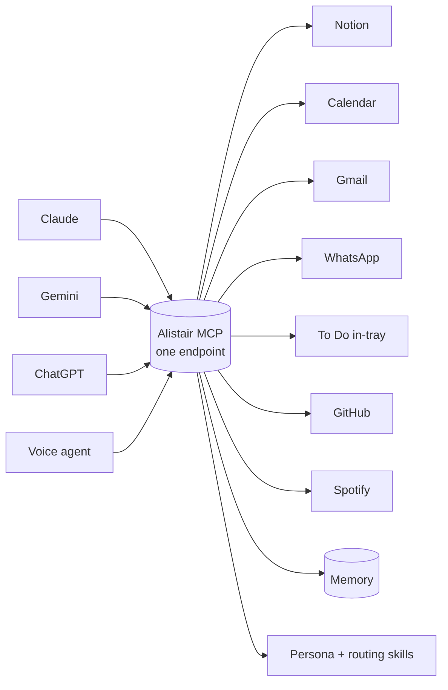

# Alistair — one assistant, any model

> One MCP server that gives Claude, Gemini, ChatGPT, or a voice agent **the same assistant**: same tools, same memory, same personality, no matter which model you use or how you reach it.


Alistair is a Jarvis-style personal assistant collapsed into a single connector. The assistant lives in the *server*, not in any one app, so the brain travels with you between models.



**Why it's model-agnostic:** every tool is exposed with a description copied near-verbatim from Claude's real connectors, backed by the official REST API, and the memory and persona are served from inside the server. Same tool descriptions, same memory, same routing rules means the same behaviour on any model that can call tools. Claude keeps connector-grade fidelity; Gemini, ChatGPT, and a voice agent inherit the identical brain.

---

## Quick start

You need Python 3.11+ and the API tokens for whichever connectors you want (all optional, set only what you use).

```bash
git clone https://github.com/owenloh/Alistair-MCP.git
cd Alistair-MCP
python3 -m venv .venv && . .venv/bin/activate
pip install -r requirements.txt
cp .env.example .env            # fill in the tokens you have
uvicorn app.main:asgi --reload  # http://127.0.0.1:8000/docs  +  /mcp
```

> `app.main:asgi` is the dispatcher that serves both the HTTP API (`/docs`, `/api/*`) **and** the MCP endpoint at `/mcp`. (`app.main:app` is the bare FastAPI app — HTTP only, no `/mcp`.)

Then point any MCP client at it:

| Client | How |
|--------|-----|
| **Claude / MCP-aware clients** | Add the remote MCP `alistair_assistant` (Streamable-HTTP) at `<base-url>/mcp`. |
| **Voice mode / scripts / custom agents** | Call the plain HTTP endpoints directly. Start with `GET /api/manifest` to discover every tool. |

Self-contained: skills and persona are served *inside* the MCP via `get_skill` / `load_context`, and memory via `get_memory` / `save_memory`. No separate skill uploads or extra connectors needed.

It ships two ways from one service: a **remote MCP** (`alistair_assistant`, Streamable-HTTP at `/mcp`) for MCP clients, **and** plain **HTTP endpoints** for anything that can make a request.

---

## What it bundles

Seven connectors, each with many tool-APIs, plus the persona/memory layer, skill descriptions, and discovery: about **82 endpoints**, with the high-value subset also exposed as **60 MCP tools** on `alistair_assistant`.

| Layer | What it is | Endpoints |
|-------|-----------|-----------|
| **Function APIs** | Connector tools that *do* things | `/api/notion/*` (16), `/api/calendar/*` (9), `/api/gmail/*` (6), `/api/whatsapp/*` (6), `/api/intray` (1), `/api/github/*` (11), `/api/spotify/*` (9), `/api/memory/*` (3), `/api/alistair/*` (5) |
| **Description APIs** | Skills that tell the model *what to do* (no code) | `/api/skill/{notion-master \| daily-brief \| notion-references-tray \| microsoft-todo-intray \| gmail \| spotify \| whatsapp}` (also via the MCP `get_skill` tool) |
| **Manifest** | The catalogue of everything | `GET /api/manifest`, plus `/docs` and `/openapi.json` |

**Connectors at a glance:**

- **Notion** (`/api/notion/*`): `search`, `fetch`, `create-pages`, `update-page`, `move-pages`, `duplicate-page`, `create-database`, `query-database`, the PARA daily-brief `query`, plus block-id primitives (`list-blocks`, `append-blocks`, `update-block`, `delete-blocks`, `move-blocks`).
- **Google Calendar** (`/api/calendar/*`): `today`, `list-events`, `list-calendars`, `get-event`, `create-event`, `update-event`, `delete-event`, `respond-to-event`, `suggest-time`.
- **Gmail** (`/api/gmail/*`): `search`, `get-thread`, `list-drafts`, `create-draft`, `update-draft`, `delete-draft`. **Read + draft only, it never sends.**
- **WhatsApp** (`/api/whatsapp/*`): `chats`, `messages`, `search`, `recent`, `find`, `draft`. **Read + draft only.** Reads proxy to a separate laptop agent over Tailscale; drafting returns a `wa.me` deep link for you to send yourself.
- **Microsoft To Do in-tray** (`/api/intray`): single hard-scoped capture list, `list` / `add` / `delete` / `done`.
- **GitHub** (`/api/github/*`): repo read, PR read/merge, and `push-file`.
- **Spotify** (`/api/spotify/*`): `playlists`, `search`, `devices`, `status`, `play`, `queue`, `control`, via a logged-in web session (no Developer app).

<details>
<summary><b>Fidelity notes (how close to the real connectors)</b></summary>

Backends are the official REST APIs, so behaviour matches the connectors closely but not always byte-for-byte.

- **Exact / clean:** all Calendar tools, the in-tray, Notion `search`, `fetch`, `query-database`, `query`, `get-users`, `create-pages`, `update-page`, `create-comment`, `get-comments`, and the block-id tools.
- **Best-effort:** `duplicate-page` (shallow copy), `create-database` / `update-data-source` (common column types, not RELATION/ROLLUP/FORMULA), `move-pages` (pages only), `move-blocks` (copies subtree then deletes original, so block ids change).
- **Returns 501 (not in the public REST API):** `get-teams`, `create-view`, `update-view`, and `update-page` commands `apply_template` / `update_verification`. Use `query-database` for filtered reads instead of views.

</details>

<details>
<summary><b>Notion writes: text-tools vs block-id-tools</b></summary>

Two write surfaces by design; the `notion-master` skill routes between them.

- **Text-tools (in-block prose edits):** `update-page` `update_content` (`content_updates=[{old_str, new_str}]`), `insert_content`, `replace_content`. `update_content` is fail-safe: multi-match guard (fails with match count unless `replace_all_matches=true`), block-boundary aware (a single `old_str` must resolve within one block), and child-page guard (refuses edits that would delete a child page/database unless `allow_deleting_content=true`).
- **Block-id-tools (all structure):** `list-blocks`, `append-blocks`, `update-block`, `delete-blocks` (deterministic, only the listed ids), `move-blocks`. Use these to nest, reorder, or delete specific blocks by id, never by text match.

The Notion-flavored markdown dialect is served two ways: the MCP resource `alistair://docs/notion-markdown-spec` and the `notion_markdown_spec` tool. Skills are served as `get_skill` and the `alistair://skills/{slug}` resource template.

</details>

<details>
<summary><b>Environment variables</b></summary>

All secrets **and personal identifiers** come from environment variables. Nothing is hardcoded, so the repo is safe to publish and fork. See `.env.example` for the full list and notes; the most important:

| Var | Used by | Notes |
|-----|---------|-------|
| `OWNER_NAME` | Persona | Who the assistant works for. Personalises every user-facing string. Defaults to a neutral "the operator" if unset. |
| `NOTION_TOKEN` | Notion | Internal integration secret. Share the Projects + Actions DBs with it. |
| `PROJECTS_DB_ID`, `ACTIONS_DB_ID` | Notion | Your Notion database ids (from each DB's URL). Blank = that feature is off. |
| `REFERENCES_TRAY_PAGE_ID`, `LIBRARY_HUB_PAGE_ID`, `BRIEFING_PAGE_ID` | Notion | Your page ids for `save_reference` / the daily brief. Blank = off. |
| `GOOGLE_CLIENT_ID/SECRET/REFRESH_TOKEN` | Calendar + Gmail | Recommended durable path: mints a fresh access token every call. Cover both scopes with `scripts/get_google_token.py`. |
| `GOOGLE_CALENDAR_ID`, `TIMEZONE`, `TIMEZONE_AUTO` | Calendar | `primary`; `TIMEZONE_AUTO=true` follows your current calendar timezone when travelling. |
| `MS_CLIENT_ID`, `MS_TODO_LIST_ID`, `MS_TENANT` | In-tray | `consumers` for personal MS accounts. |
| `GITHUB_GIST_TOKEN`, `GIST_ID` | In-tray + GitHub | Classic PAT (`gist` scope); private gist storing the MS refresh token. |
| `GITHUB_REPO_TOKEN` | GitHub | Repo read + PR token, distinct from the gist token. Scope is the token's. |
| `SPOTIFY_COOKIES`, `SPOTIFY_USERNAME` | Spotify | Logged-in open.spotify.com cookies (`sp_dc` essential). Refresh when calls start 401ing. |
| `WHATSAPP_AGENT_URL/SECRET` | WhatsApp (read) | Laptop read-agent over Tailscale. Blank disables reading; drafting still works. |
| `SERVICE_API_KEY` | All `/api/*` | If set, every call must send `X-API-Key`. |

</details>

---

## Deploy to Railway

1. Push this repo to GitHub and create a Railway service from it.
2. Set the env vars in the service **Variables** tab (`RAILWAY_ENV=production` and a strong `SERVICE_API_KEY`).
3. Railway uses `railway.toml` (Nixpacks → `uvicorn app.main:asgi --host 0.0.0.0 --port $PORT --proxy-headers --forwarded-allow-ips=*`). Health check: `/health`.

## Voice-mode setup

Voice mode can't see the API on its own; it needs one small instruction telling it the API exists and how to discover the rest. Put a compact pointer in your **Claude profile → Personal preferences**, and let the model fetch `/api/manifest` and the skill endpoints for detail.

```
In voice mode I have no Notion/Calendar connectors and no skills. When a request
touches my Notion, Google Calendar, or Microsoft To Do in-tray, call my HTTP API
instead of refusing.
Base: https://<your-app>.up.railway.app   Header: X-API-Key: <key>
Discover: GET /api/manifest lists every tool. Skill rules: GET /api/skill/<slug>.
Shortcuts: daily brief -> POST /api/notion/query ; POST /api/calendar/today ;
POST /api/intray {"action":"list"}. Add to in-tray -> POST /api/intray
{"action":"add","title":"X"}. Notion writes -> GET /api/skill/notion-master first.
```

The manifest is self-describing (it carries `how_to_use`, a `shortcuts` block, and the skill catalogue), so you can shrink the prompt further and let the model bootstrap from `GET /api/manifest` on first use. Trade-off: one extra round-trip on the first voice request per session.

## Extending

Adding a new tool or integration: follow [`docs/ADDING_TOOLS.md`](docs/ADDING_TOOLS.md) for the full runbook. Short version: add an `op_*` in the service, a route with the verbatim description, an MCP `@mcp.tool` wrapper, and a `load_context` routing entry. The description plus routing entry are the minimum that makes a new capability propagate to every client (claude.ai, voice, Gemini, ChatGPT) on deploy. New skills are even simpler: drop `app/skills/data/<slug>.json` and it serves at `/api/skill/<slug>` automatically.

## Security

All secrets load from environment variables; only `.env.example` (placeholders) is committed, and `.env` is gitignored. Keep real tokens in your host's variable store (Railway Variables), never in the repo. If you set `SERVICE_API_KEY`, every `/api/*` call must present a matching `X-API-Key`.

## License

MIT — see [LICENSE](LICENSE).
